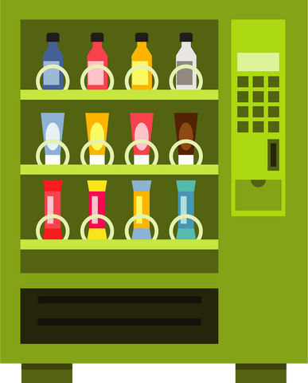

# Vending Machine

Building a vending machine in Kotlin because ... why not? 🙂

## How to start? 🤔

1. Make sure you have [azul-13-sdk](https://www.azul.com/downloads/?package=jdk)
   installed for Kotlin.
2. Go to `src/main/kotlin/Main.kt` and run the `main()` function.

## Implementation 🔧

### Functionality ✨

The vending machine works with list of coins and can also return change. 🧙‍

For now this basic implementation supports the following types of drinks:

* Americano
* Café Au Lait
* Cappuccino
* Cortado
* Decaf
* Drink
* Espresso
* Flat White
* Iced Coffee
* Irish Coffee
* Latte
* Macchiato
* Mocha
* Tea
* Water

### Architecture ⚙️

The choice of a drink is based
on [Factory Pattern](https://en.wikipedia.org/wiki/Factory_(object-oriented_programming)). All the
drinks implement the abstract sealed class `Drink` and inherit it. with the help
of [sealed classes](https://kotlinlang.org/docs/sealed-classes.html) in Kotlin, we can avoid the use
of pattern matching/`switch`/`if...else` statements and can autoload new implementations.