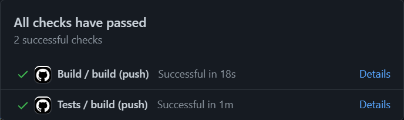

# Vending Machine


Building a vending machine in Kotlin because ... why not? 🙂

## How to start? 🤔

1. Make sure you have [azul-13-sdk](https://www.azul.com/downloads/?package=jdk) installed for
   Kotlin.
2. Go to [Main.kt](src/main/kotlin/Main.kt) and run the `fun main()` function.

## Implementation 🔧

### Functionality ✨

The vending machine works with a list of coins and can also return change. 🧙‍

For now, this basic implementation supports the following types of drinks:

* Americano, Café Au Lait, Cappuccino, Cortado, Decaf, Espresso, Flat White, Iced Coffee, Irish
  Coffee, Latte, Macchiato, Mocha, Tea, Water

### Architecture ⚙️

#### State pattern

The vending machine uses State Pattern and has several states - `Idle`, `Running`, `Paused`
and `Stopped` and the transition goes as follows:

```text
+------------+     start()      +------------+
|    Idle    | ---------------> |   Running  |
+------------+                  +------------+
                                   |
                                   |
                                   |
                                   | pause()
                                   |
                                   |
                                   v
+------------+                  +------------+
|   Stopped  | <--------------- |   Paused   |
+------------+      stop()      +------------+
```

#### Choice of drink 🍶 and container 📥📤

The choice of a drink and container is based on
the [Factory Pattern](https://en.wikipedia.org/wiki/Factory_(object-oriented_programming)). All the
drinks and containers implement the abstract sealed classes `Drink` and `Container` respectively,
and inherit them. With the help of [sealed classes](https://kotlinlang.org/docs/sealed-classes.html)
in Kotlin, we can avoid the use of pattern matching/`switch`/`if...else` statements and can autoload
new implementations.

For now, there are a few containers - water, beans, tea, milk, and sugar. When a certain container
is chosen, the amount in the container decreases. If the container is empty, an exception is thrown
to notify the user.

## Contribution strategy 🌿

The work is being done directly on the `main` branch. It's a hobby project, so nothing sophisticated
is planned (for now). 😉 In the Git messages you can find the following emojis, meaning:

| Emoji | Action                  |
|:-----:|-------------------------|
|  🔨   | refactoring             |
|   ✨   | feature                 |
|  🐛   | bug fixed               |
|  📚   | update `README.md`      |
|   ✅   | update tests            |
|  🚀   | update building scripts |

## CI/CD 🚀

When a new commit is pushed, a [GitHub Actions](https://github.com/features/actions) pipeline is
triggered. This is acquired by the [build.yml](.github/workflows/build.yml)
and [tests.yml](.github/workflows/tests.yml) files. Example:


